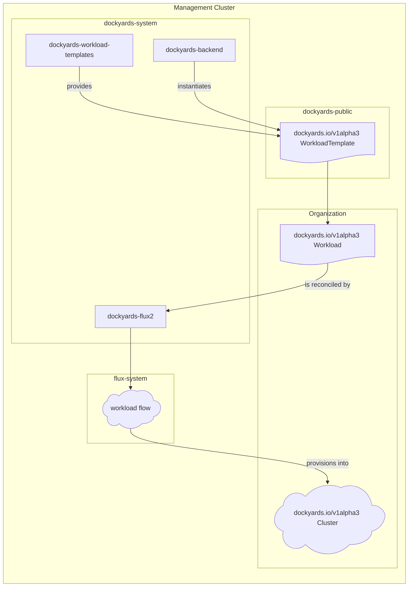

# Dockyards Workload Templates

`dockyards-workload-templates` bundles the shared CUE templates that define the catalog of deployable workloads, the generator that turns those templates into `WorkloadTemplate` CRDs, and the curated manifests you apply into the management cluster (usually `dockyards-public`). This component is primarily a content pipeline: maintainers edit reusable CUE packages, run `generate-workloadtemplate-manifests`, and publish the resulting CRDs. The component diagram below shows how the generator, backend, and Flux stack stitch together to get workloads into target clusters.

## Component diagram

The flowchart tracks the key CRDs and services involved: template authors maintain the CUE source inside this repo, the generator produces checked-in `WorkloadTemplate` manifests, `dockyards-backend` instantiates `Workload` CRs that reference them, and `dockyards-flux2` turns the workload into Flux Helm/Kustomize sources (`WorkloadFlow`) that eventually provision into the workload cluster.

## Workflow

- Edit or add a package under `templates/` that defines the required `#cluster` and `#workload` helpers plus any component-specific input hooks (e.g., Helm releases, secrets, Ingress routes).
- Run `go run ./cmd/generate-workloadtemplate-manifests --root templates --outpath manifests` to regenerate the `manifests/workloadtemplate_*.yaml` files from the CUE source.
- Commit and apply the manifests (or `kustomize build manifests`) to the `dockyards-public` namespace so the `dockyards.io/v1alpha3 WorkloadTemplate` objects are visible to the backend.
- When an operator creates a `Workload` that references one of these templates, `dockyards-backend` instantiates the CR and `dockyards-flux2` reconciles it into the Flux primitives shown as `WorkloadFlow`, which ultimately provision workloads into the `dockyards.io/v1alpha3 Cluster` target.

## Generation details

- Source templates live under `templates/<component>/<component>.cue` and are parsed via the CUE toolchain embedded in `cmd/generate-workloadtemplate-manifests`.
- The generator sanitizes the template names, emits each manifest as `workloadtemplate_<name>.yaml`, and writes `manifests/kustomization.yaml` so installers can apply the entire catalog with a single `kustomize build`.
- Keep the `manifests/` directory checked in so operators can deploy the exact `WorkloadTemplate` catalog that matches the CUE source. Re-running the generator before pushing keeps the checked-in YAML and CUE in sync and prevents drift between the API-facing objects and their construction logic.
